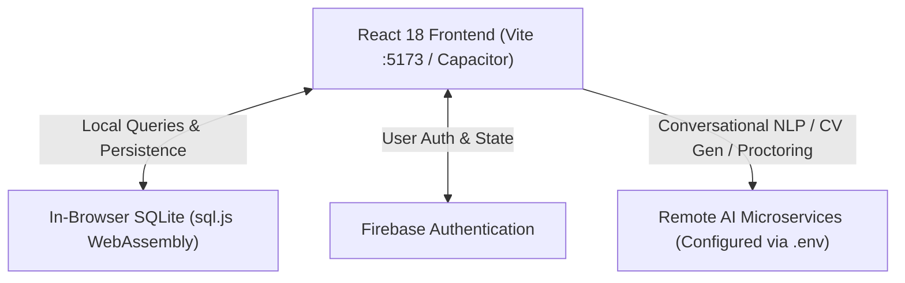

# SKILLIFY

An AI-powered adaptive learning, skill assessment, and internship matching platform featuring real-time WebRTC proctoring, client-side SQLite database persistence, and remote AI intelligence.

---

##  Architecture Overview

Skillify AI is built as a modular, high-performance client application powered by a remote AI server:

```
skillify/
├── frontend/              # React 18 + Vite + TailwindCSS + Capacitor
│   ├── src/
│   │   ├── components/      # Reusable UI & Navigation Components
│   │   ├── context/         # Global AppContext state provider
│   │   ├── db/              # Client-Side SQLite Database (sql.js Wasm)
│   │   ├── hooks/           # useProctoring WebRTC proctoring hook
│   │   ├── screens/         # ActiveQuiz, Courses, Internships, Chat, etc.
│   │   └── services/        # Firebase Auth & Remote AI API clients
│   └── android/             # Native Capacitor Android Studio project
├── camera.md             # In-depth technical report on WebRTC proctoring
└── package.json          # Monorepo scripts & orchestration
```



---

##  Key Features

- ** Live AI Assessment & Proctoring**: Real-time face detection, gaze tracking, anomaly detection, multi-camera switching, and simulated canvas fallback for laptop and mobile devices.
- ** Client-Side SQLite Database**: High-speed SQL querying with `sql.js` (WebAssembly) stored directly in browser local storage—no local backend server required.
- ** Smart AI Chatbot & CV Builder**: Conversational assistant and automated ATS resume synthesizer connected to the remote AI server.
- ** Adaptive Learning & Quizzes**: Timed assessments, instant scoring, strike counter, and XP progression.
- ** Native Mobile Ready**: First-class Android integration via Capacitor (`@capacitor/android`).

---

##  Environment Configuration

Set up your remote AI service endpoint in [`frontend/.env`](file:///home/alpha/skillify/frontend/.env):

```env
VITE_CHATBOT_API_URL=https://<your-remote-ai-server>.ngrok-free.dev
VITE_CV_API_URL=https://<your-remote-ai-server>.ngrok-free.dev
```

---

##  Quick Start

### 1. Install Dependencies
```bash
npm install
npm --prefix frontend install
```

### 2. Run Local Development Server
```bash
npm run dev
```
The app will be live at `http://localhost:5173`.

### 3. Build for Production
```bash
npm run build
```

---

## 📜 Available Scripts

| Command | Description |
|---|---|
| `npm run dev` | Launch Vite React dev server (`localhost:5173`) |
| `npm run build` | Compile optimized production bundle to `frontend/dist/` |
| `npm run preview` | Preview production build locally |
| `npm run android:sync` | Sync frontend production build with Capacitor Android |
| `npm run android:open` | Open Android project in Android Studio |
| `npm run android:build` | Build Android Debug APK (`gradlew assembleDebug`) |
| `npm run android:build:release` | Build Android Release APK (`gradlew assembleRelease`) |

---

## 📱 Android Studio & Mobile Deployment

### Open in Android Studio
1. Launch **Android Studio**.
2. Select **Open** and choose the directory: [`frontend/android`](file:///home/alpha/skillify/frontend/android).
3. Android Studio will automatically sync Gradle and load the native project.

### Mobile Camera & Permissions
The Android build uses `android.permission.CAMERA` and `android.permission.RECORD_AUDIO` to enable live proctoring directly in the mobile Webview.