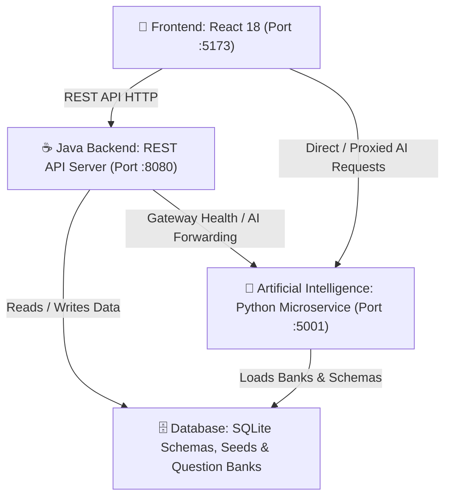

# SKILLIFY AI 🚀

An AI-powered learning and freelance platform featuring discrete multi-language system architecture:
- **`frontend/`**: React 18 + Vite + Tailwind + Capacitor (JavaScript)
- **`backend/`**: Multi-threaded REST API Microservice (Java 24)
- **`artificial_intelligence/`**: NLP Engines, AI Chatbot Assistant & CV Generator (Python)
- **`database/`**: Canonical SQLite Schemas, Seed Data & Question Banks

---

## 🏛️ Multi-Language Architecture

```
skillify-ai/
├── 📱 frontend/                 # Client UI (JavaScript / React 18 / Tailwind / Capacitor)
├── ☕ backend/                  # Discrete Core Backend REST API (Java 24)
├── 🧠 artificial_intelligence/  # NLP Engines, AI Assistant & CV Generator (Python)
└── 🗄️ database/                 # SQLite Schemas, Migrations & Canonical Datasets
```



---

## 📁 Pillar Details & Languages

| Directory | Primary Language | Port | Description |
|---|---|---|---|
| **`frontend/`** | **JavaScript / JSX** | `:5173` | React 18 client application with modern animations, courses, internships, quizzes, badges, and chat interface. |
| **`backend/`** | **Java (JDK 24)** | `:8080` | High-performance multi-threaded REST API server with controllers for User Profiles, XP/Streaks, Internships, Applications, and Projects. |
| **`artificial_intelligence/`** | **Python (3.9+)** | `:5001` / `:8000` | Conversational NLP assistant (`chatbot/`), AI skill assessment engine (`quiz_engine/`), and automated ATS CV synthesizer (`cv_generator/`). |
| **`database/`** | **SQL / JSON** | N/A | SQLite table schemas (`schema.sql`), student seed fixtures, and canonical assessment question banks. |

---

## ⚡ Quick Start

### 1. Install Dependencies
```bash
# Frontend dependencies
npm install
npm --prefix frontend install

# AI Python dependencies
pip install -r artificial_intelligence/requirements.txt
```

### 2. Build the Java Backend
```bash
backend\build.bat
```

### 3. Run the Full Stack
To run the **Java Backend** (`:8080`), **AI Chatbot** (`:5001`), and **React Frontend** (`:5173`) concurrently:
```bash
npm run dev:all
```

---

## 📜 Available Scripts

| Command | Description |
|---|---|
| `npm run dev:all` | Run Java Backend, AI Chatbot, and React Frontend concurrently |
| `npm run dev` | Run Vite React frontend only (`localhost:5173`) |
| `npm run backend` | Run Java Backend server (`localhost:8080`) |
| `npm run backend:build` | Compile Java Backend (`javac`) |
| `npm run chatbot` / `npm run ai` | Run Python AI Chatbot assistant (`localhost:5001`) |
| `npm run ai:cv` | Run Python AI CV Generator server (`localhost:8000`) |
| `npm run ai:quiz` | Run Python AI interactive skill assessment engine |
| `npm run build` | Build React frontend for production (`dist/`) |
| `npm run android:sync` | Sync build with Capacitor Android project |
| `npm run android:open` | Open project in Android Studio |
| `npm run android:build` | Build debug APK (`gradlew assembleDebug`) |
| `npm run android:build:release` | Build release APK (`gradlew assembleRelease`) |

---

## 📱 Android Studio & APK Instructions

### Open in Android Studio
1. Open **Android Studio**.
2. Click **Open** (or `File > Open...`).
3. Select the folder: `frontend/android` (`c:\Users\sapta\skillify ai\frontend\android`).
4. Android Studio will automatically sync Gradle and load the native project.

### Generated APK Locations
- **Root Ready-to-Install APK**: [`Skillify-AI.apk`](file:///c:/Users/sapta/skillify%20ai/Skillify-AI.apk)
- **Gradle Debug APK**: [`frontend/android/app/build/outputs/apk/debug/app-debug.apk`](file:///c:/Users/sapta/skillify%20ai/frontend/android/app/build/outputs/apk/debug/app-debug.apk)
- **Gradle Release APK**: [`frontend/android/app/build/outputs/apk/release/app-release-unsigned.apk`](file:///c:/Users/sapta/skillify%20ai/frontend/android/app/build/outputs/apk/release/app-release-unsigned.apk)