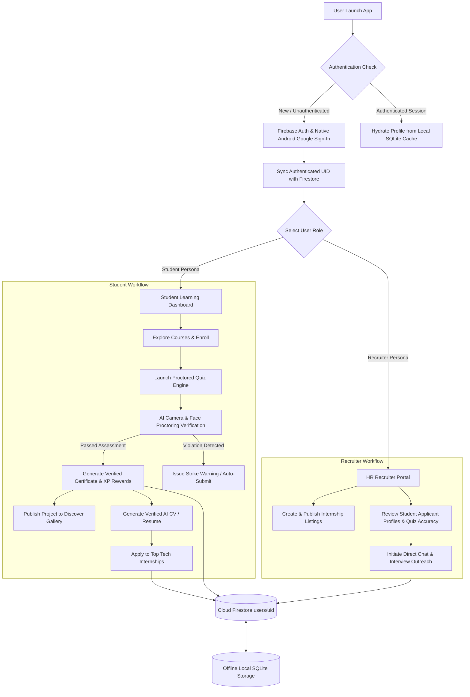

# Skillify AI — End-to-End Project Workflow & System Architecture
> **Hackathon Presentation & Slide Deck Specification**

---

## 1. Executive Summary & Core Value Proposition

**Skillify AI** is an AI-powered career readiness platform that bridges the gap between student learning and recruiter hiring. It combines adaptive AI course progression, real-time proctored skill assessments, automated verified certificate generation, and a direct hiring pipeline for recruiters.

```
       [ Student Learner ]                                 [ HR / Recruiter ]
                │                                                  │
                ▼                                                  ▼
 ┌─────────────────────────────┐                    ┌─────────────────────────────┐
 │ 1. Firebase Auth / Mobile   │                    │ 1. Recruiter Verification   │
 │ 2. Skill & Role Selection   │                    │ 2. Post Internships         │
 │ 3. Proctored AI Quizzes     │                    │ 3. Review Student Profiles  │
 │ 4. Verified Certifications  │                    │ 4. Direct Talent Outreach   │
 └──────────────┬──────────────┘                    └──────────────┬──────────────┘
                │                                                  │
                └──────────────────────┬───────────────────────────┘
                                       ▼
                       ┌───────────────────────────────┐
                       │ Cloud Firestore & SQLite Sync │
                       └───────────────────────────────┘
```

---

## 2. System Architecture & Workflow Diagram



---

## 3. Detailed Slide-by-Slide Workflow Breakdown

### Slide 1: Platform Architecture & Multi-Platform Identity
* **Single Source of Truth**: Powered by **Firebase Authentication** with native Google Sign-In for Android (via Capacitor native bridge).
* **Dual-Layer Persistence**: 
  - **Online**: Real-time Cloud Firestore synchronization under per-user subcollections (`users/{uid}/*`).
  - **Offline**: Zero-latency local **SQLite Client (`sqliteDB`)** ensuring 100% offline availability without data loss.

---

### Slide 2: Persona-Based Onboarding & Role Selection
* **Student Mode**: Personalized learning paths tailored to specific tracks (Frontend, Data Structures & Algorithms, UI/UX, Python & Data Science).
* **Recruiter Mode**: Company verification, HR profile completion, and candidate discovery tools.

---

### Slide 3: Adaptive AI Examination & Live Proctoring
* **Dynamic AI Quiz Engine**: Context-aware questioning algorithm with real-time scoring and skill weakness mapping.
* **Smart Face & Video Proctoring (`useProctoring`)**:
  - Live WebCam feed with automated multi-camera selection.
  - Computer vision verification: detects missing face, tab switching, or multi-face presence.
  - Automated 3-strike violation warning system before forced submission.

---

### Slide 4: Real-time Cloud Synchronization & Verified Credentials
* **Cloud Firestore Integration**:
  - `users/{uid}/enrollments`: Active and completed course records.
  - `users/{uid}/progress`: Lesson completion percentage and module checkpoints.
  - `users/{uid}/activity`: Time-stamped learning sessions and quiz logs.
  - `users/{uid}/certificates`: Tamper-proof digital completion credentials.
* **Automated CV Generator**: One-click professional PDF resume builder loaded with verified skill badges and project links.

---

### Slide 5: Discover Gallery & Recruiter Hiring Bridge
* **Student Project Gallery**: Public showcase of verified community projects with star ratings and GitHub source repository views.
* **Recruiter Dashboard**:
  - Instant applicant filtering based on verified quiz accuracy scores and earned badges.
  - Built-in real-time messaging system to connect recruiters directly with top student developers.

---

## 4. Technology Stack Matrix

| Layer | Technologies Used | Key Responsibilities |
| :--- | :--- | :--- |
| **Frontend UI / UX** | React 18, Vite 6, TailwindCSS, Lucide Icons | Responsive, mobile-first single page application with dark mode support. |
| **Native Mobile Wrapper** | Capacitor 8 (Android SDK 34+) | Native Android WebViews, camera permissions, back-button handlers, and APK builds. |
| **Identity & Security** | Firebase Auth v12, `@codetrix-studio/capacitor-google-auth` | OAuth 2.0 Google Sign-In, Email/Password auth, ID token validation. |
| **Cloud Database** | Cloud Firestore | Real-time per-user subcollections (`users/{uid}/*`) with strict security rules. |
| **Offline Storage** | Client-Side SQLite Engine (`sqliteDB`) | Relational persistence, zero-latency local caching, offline resilience. |
| **AI Proctoring Engine** | Custom React Hook (`useProctoring`), HTML5 Canvas | Camera feed analysis, face loss detection, strike alert overlays. |
| **Build & Tooling** | Android Studio, Gradle 8.13, Vite Bundler | Automated APK generation and optimized static asset compilation. |

---

## 5. Key Pitch Highlights for Judges

1. **End-to-End Skill Verification**: Solves resume inflation by backing student profile claims with live proctored quiz results and verified certificates.
2. **Offline-First Resilience**: Works seamlessly offline using local SQLite caching and syncs back to Cloud Firestore when network connectivity is restored.
3. **Cross-Platform Readiness**: Single codebase deployed to both Web Browsers and Native Android APKs via Capacitor.
4. **Recruiter-Centric UX**: Cuts hiring time for HR recruiters by surfacing candidate quiz accuracy and verified project portfolios directly.
